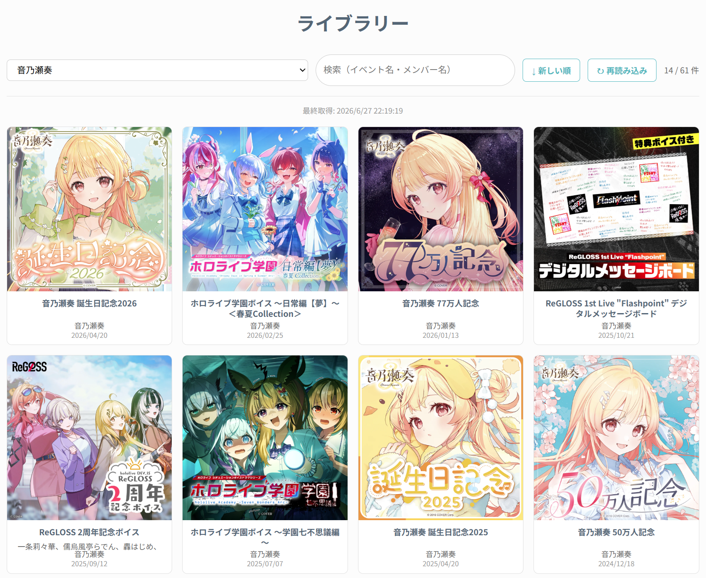

# Hololive Digital Library Organizer

ホロライブオフィシャルショップで購入したデジタルコンテンツ（ボイス・ASMR・デジタルメッセージボード等）のライブラリーページを、検索・フィルタ・ソート可能なカード表示に変換する Chrome 拡張機能です。

## こんな人向け

- ボイスをたくさん買っていて、ライブラリーが何ページにもなって探しづらい
- 「あのメンバーのボイス、いつ買ったっけ？」を素早く見つけたい
- 一覧をスクロールだけで見渡したい

## 機能

- **カード表示**: サムネイル付きのタイル表示で一覧性アップ（ページ遷移不要）
- **メンバーフィルタ**: ドロップダウンで特定メンバーの購入コンテンツだけ表示
- **自由検索**: イベント名・メンバー名でリアルタイム絞り込み
- **日付ソート**: 新しい順 / 古い順をワンクリックで切り替え
- **キャッシュ**: 2回目以降は即時表示。新しいコンテンツを買ったら「再読み込み」ボタンで差分更新

## スクリーンショット



## インストール方法

Chrome ウェブストアには公開していないため、手動でインストールします。

### 1. ダウンロード

このリポジトリをダウンロードします。

- **ZIP の場合**: ページ上部の「Code」→「Download ZIP」→ 展開
- **Git の場合**: `git clone https://github.com/<your-username>/holo-library-ext.git`

### 2. Chrome に読み込む

1. Chrome で `chrome://extensions` を開く
2. 右上の「**デベロッパーモード**」をオンにする
3. 「**パッケージ化されていない拡張機能を読み込む**」をクリック
4. ダウンロードした `holo-library-ext` フォルダを選択

### 3. 使う

[ホロライブショップ](https://shop.hololivepro.com/)にログインし、マイページ → ライブラリー を開くだけです。自動的にカード表示に切り替わります。

初回はすべてのコンテンツの読み込みに 20〜40 秒ほどかかります。2回目以降はキャッシュから即時表示されます。

### アップデート

新しいバージョンをダウンロード（または `git pull`）した後、`chrome://extensions` で拡張機能の「更新」ボタン（↻）を押してください。

---

## 安全性について

### この拡張は何をするの？

- ホロライブショップの **ライブラリーページ上でのみ** 動作します（他のサイトでは一切動きません）
- ページの表示を見やすく整理するだけです
- ショップ上のデータを**読み取るだけ**で、購入・削除・変更などの操作は一切行いません

### データはどこに送られるの？

**どこにも送りません。** すべての処理はブラウザ内で完結します。

- 取得したデータはブラウザの LocalStorage（ブラウザ内の保存領域）にのみ保存されます
- 外部サーバーへの通信は一切ありません
- 広告・トラッキング・アナリティクスも含まれていません

### アカウント情報は大丈夫？

この拡張はパスワードやアカウント情報に**一切アクセスしません**。ログイン処理はショップのページ自体が行い、拡張は表示されたライブラリーの中身を読み取って並び替えているだけです。

### ソースコードを確認できる？

はい。この拡張は 3 ファイル（JavaScript 1 つ、CSS 1 つ、設定ファイル 1 つ）で構成されており、すべてこのリポジトリで公開しています。難読化や圧縮は行っていないので、そのまま読めます。

---

## 技術詳細

### 構成ファイル

| ファイル | 役割 |
|---|---|
| `manifest.json` | Chrome 拡張の設定。Manifest V3 準拠 |
| `content.js` | メインロジック。データ取得・UI 構築・キャッシュ管理 |
| `styles.css` | カードグリッド・ツールバーのスタイル |

### 動作の仕組み

#### 1. 購入コンテンツの収集

ライブラリーページは Sky Pilot（Shopify のデジタルコンテンツ配信アプリ）で構築されています。ページ内の `.sky-pilot-list-item` 要素からアイテム情報（タイトル・サムネイル・リンク）を取得し、ページネーションを自動的に辿って全アイテムを収集します。

#### 2. 商品情報の補完

Sky Pilot のページにはメンバー名や正確な販売日が含まれないため、Shopify の公開 API（`/products.json`）から補完します。

- **販売日**: `published_at` フィールドから年月日を取得
- **メンバー名**: 商品タグの `Talent_xxx` から抽出し、ライブラリーの見出しテキストと照合して、実際に購入したメンバーだけを表示

`/products.json` は Shopify ストアの公開エンドポイントで、認証不要・誰でもアクセス可能なものです。250 件ずつページ送りし、購入済みの全商品が見つかった時点で停止します（全商品を取得するわけではありません）。

#### 3. メンバー名の特定ロジック

1. 全商品の `Talent_` タグからグローバルなメンバー名リストを構築
2. 各アイテムの見出し全文に対して、メンバー名リストで照合（長い名前から順にマッチ）
3. 一致したメンバーのみ表示（複数購入時は全員表示）
4. 一致なし＆単独メンバー商品 → タグのメンバーをそのまま採用
5. 一致なし＆複数メンバー商品（フルセット購入等） → タグの全メンバーを表示

#### 4. キャッシュ

- 初回取得後、ブラウザの LocalStorage に保存
- 2回目以降はキャッシュから即時表示
- 「再読み込み」ボタンで最新データを取得し、差分をマージ
- ページの再読み込み（F5）ではキャッシュを利用
- キャッシュを完全にクリアしたい場合は、開発者ツール（F12）→ Application → Local Storage から `hlo_items_cache` を削除

#### 5. ナビゲーション状態の保持

カードをクリックして詳細ページに遷移し、ブラウザの「戻る」で戻った際に、フィルタ・検索・ソートの状態が復元されます（sessionStorage を使用）。ページの再読み込みではリセットされます。

### 権限

```json
"matches": ["https://shop.hololivepro.com/apps/downloads/orders/*"]
```

この拡張が動作するのは上記 URL パターンに一致するページ（＝ライブラリーページ）のみです。他のサイトやショップの他のページでは一切実行されません。バックグラウンドスクリプトやサービスワーカーも使用していません。

---

## ライセンス

MIT License
